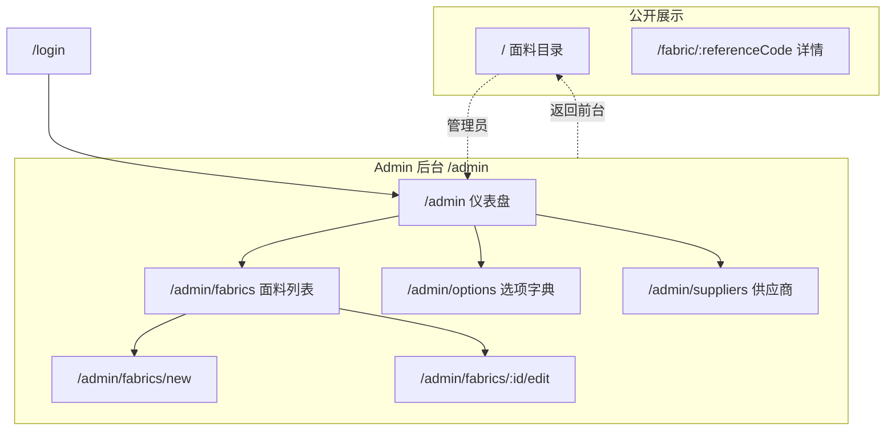

# Fabric Admin Panel 设计稿

> 状态：待评审 · 日期：2026-06-05  
> 关联：公开展示页 Modern 主题（`FabricPreview`）、现有 `MainLayout` / `fabric.vue`

## 1. 背景与目标

### 1.1 现状

| 区域 | 路径 | 布局 | 问题 |
|------|------|------|------|
| 公开展示 | `/` | 新 Hero + 卡片主题 | 已完成升级 |
| 面料管理（核心后台） | `/fabric` | 独立全屏，无侧栏 | 登录默认入口，但不在导航体系 |
| 项目/模板/供应商 | `/menu/*` | `MainLayout` 侧栏 | 侧栏无面料管理；项目/模板偏遗留 |
| 公开详情 | `/fabric/:ref` | 公开展示风格 | 与后台 `/fabric` 列表路径易混淆 |

### 1.2 设计目标

1. **统一后台** — 所有管理功能纳入同一 Admin 壳层（侧栏 + 顶栏 + 内容区）
2. **操作优先** — 面料录入/编辑/筛选/批量打印为主工作流，减少页面跳转
3. **风格延续** — 沿用公开展示的 ivory + 金色 token，后台偏紧凑、效率型
4. **路由清晰** — `/admin/*` 管理，`/` 与 `/fabric/:ref` 公开，语义分离

### 1.3 非目标（本期不做）

- 复杂 RBAC 多角色权限
- 项目/模板看板的深度重构（可保留或降级为次要入口）
- 移动端后台完整适配（保证桌面 1280px+ 体验即可）

---

## 2. 信息架构



### 2.1 侧栏菜单结构

| 顺序 | 菜单项 | 路由 | 图标 | 说明 |
|------|--------|------|------|------|
| 1 | 仪表盘 | `/admin` | Dashboard | 统计 + 快捷入口 |
| 2 | 面料管理 | `/admin/fabrics` | Grid/Table | 核心列表，表格视图 |
| 3 | 选项字典 | `/admin/options` | List | 成分/风格/工艺选项 CRUD |
| 4 | 供应商 | `/admin/suppliers` | Shop | 迁入现有 supplier 页 |
| — | 分隔线 | — | — | — |
| 5 | 返回前台 | `/` | ExternalLink | 新标签或同页跳转 |
| 6 | 项目/模板 | `/menu/project` | Folder | **可选保留**，标记为「扩展模块」 |

> 建议：项目/模板默认折叠在「更多」分组，避免干扰面料主流程。

---

## 3. 布局壳层 `AdminLayout`

### 3.1 结构

```
┌──────────────────────────────────────────────────────────────┐
│ TopBar: Logo · 面包屑 · [预览前台] · 用户菜单                 │  56px
├────────────┬─────────────────────────────────────────────────┤
│ Sidebar    │ PageHeader: 标题 + 描述 + 主操作按钮             │
│ 220px      ├─────────────────────────────────────────────────┤
│ 可折叠64px │ Content (padding 24px, max-width 1440px)        │
│            │                                                 │
│ · 仪表盘   │                                                 │
│ · 面料管理 │                                                 │
│ · 选项字典 │                                                 │
│ · 供应商   │                                                 │
│            │                                                 │
│ [收起]     │                                                 │
└────────────┴─────────────────────────────────────────────────┘
```

### 3.2 与公开展示的差异

| 维度 | 公开展示 `/` | Admin `/admin/*` |
|------|-------------|------------------|
| 顶栏 | 深色品牌条 + 登录/收藏 | 浅色/深色紧凑条 + 面包屑 |
| 主内容 | Hero + 卡片网格 | 无 Hero，PageHeader + 数据区 |
| 字体 | Display 标题突出 | Body 为主，标题适中 |
| 密度 | 宽松、视觉展示 | 紧凑表格、固定工具栏 |
| 搜索 | 折叠简约栏 | 同组件 `FabricSearchForm`（`variant="admin"`） |

### 3.3 设计 Token（复用 + 扩展）

```css
/* 复用现有 */
--fabric-bg, --fabric-surface, --fabric-ink, --fabric-muted,
--fabric-accent, --fabric-accent-soft, --fabric-border
--font-display, --font-body

/* Admin 扩展 */
--admin-sidebar-bg: #1c1917;
--admin-sidebar-text: rgba(250, 248, 245, 0.75);
--admin-sidebar-active: var(--fabric-accent-soft);
--admin-content-bg: var(--fabric-bg);
--admin-page-header-height: 72px;
```

---

## 4. 页面设计

### 4.1 仪表盘 `/admin`

**目的**：登录后第一眼，掌握运营状态 + 一键进入高频操作。

```
┌─ PageHeader ─────────────────────────────────────────────┐
│ 仪表盘                                    [+ 添加面料]    │
│ 欢迎回来，{username}                                      │
└──────────────────────────────────────────────────────────┘

┌─ Stats (4 列) ───────────────────────────────────────────┐
│ 面料总数 │ 今日访客 │ 总访客 │ 我的收藏                    │
│   128    │    12    │  3.2k  │    8                       │
└──────────────────────────────────────────────────────────┘

┌─ Quick Actions ─────────────┐  ┌─ Recent Fabrics ─────────┐
│ [添加面料] [选项字典]        │  │ REF · 成分 · 更新时间     │
│ [供应商]   [预览前台]        │  │ ...                      │
└─────────────────────────────┘  └──────────────────────────┘
```

**数据接口（已有）**

- `GET /api/fabrics/list` — total
- `GET /api/fabrics/visitor_stats` — 访客
- `GET /api/fabrics/fabrics/my_favorites` — 收藏数
- 最近面料：list 取 `page_size=5`

### 4.2 面料列表 `/admin/fabrics`

**目的**：批量管理主战场，保留表格效率，统一搜索与操作区。

```
┌─ PageHeader ─────────────────────────────────────────────┐
│ 面料管理 · 128 件                                         │
│ [+ 添加] [打印预览] [选项字典]                               │
└──────────────────────────────────────────────────────────┘

┌─ FabricSearchForm (折叠简约) ──────────────────────────────┐
│ [参考号] [面料编号] [搜索] [更多筛选 ▼]                      │
└──────────────────────────────────────────────────────────┘

┌─ FabricTable (classic) ────────────────────────────────────┐
│ □ │ 收藏 │ REF │ 图片 │ 成分 │ 风格 │ 工艺 │ 备注 │ 操作   │
│ ...                                                        │
└──────────────────────────────────────────────────────────┘
│ 分页                                                       │
```

**变更点**

- 从 `fabric.vue` 迁入，移除独立 `min-h-screen` 白底
- `OptionDialog` 改为跳转 `/admin/options`（或保留快捷入口 + 独立页双轨）
- 编辑跳转 `/admin/fabrics/:id/edit`
- 添加跳转 `/admin/fabrics/new`

### 4.3 添加/编辑面料 `/admin/fabrics/new` · `/admin/fabrics/:id/edit`

- 复用 `add-fabric.vue` 表单逻辑
- 外层套 `AdminLayout` + 面包屑：`面料管理 / 添加面料`
- 表单区 max-width 960px 居中，左侧步骤感（可选后期）

### 4.4 选项字典 `/admin/options`

- 将 `OptionDialog` 表格逻辑提升为整页
- 分类 Tab：成分 / 风格 / 工艺
- 表格内联编辑 + 添加行

### 4.5 供应商 `/admin/suppliers`

- 迁入 `supplier/index.vue` 内容
- 统一 PageHeader 与表格样式

---

## 5. 路由迁移方案

| 旧路径 | 新路径 | 处理 |
|--------|--------|------|
| `/fabric` (列表) | `/admin/fabrics` | 301 重定向或 router alias |
| `/fabric/add` | `/admin/fabrics/new` | redirect |
| `/fabric/edit/:id` | `/admin/fabrics/:id/edit` | redirect |
| `/fabric/:ref` (公开) | 不变 | — |
| `/menu/supplier` | `/admin/suppliers` | redirect |
| 登录后默认 | `/admin` | 改 router beforeEach |

---

## 6. 组件拆分

```
src/layout/
  AdminLayout.vue          # 新：侧栏 + 顶栏 + router-view
  AdminSidebar.vue
  AdminTopBar.vue
  AdminPageHeader.vue      # 标题 + actions slot

src/views/admin/
  Dashboard.vue
  fabrics/
    FabricList.vue         # 从 fabric.vue 迁入
    FabricForm.vue         # 从 add-fabric.vue 迁入
  options/
    OptionList.vue         # 从 OptionDialog 提升
  suppliers/
    SupplierList.vue       # 从 supplier/index 迁入

src/router/
  adminRoutes.ts           # /admin 子路由表
```

---

## 7. 实施阶段

| 阶段 | 内容 | 预估 | 优先级 |
|------|------|------|--------|
| P1 | `AdminLayout` + 路由 `/admin/*` + 面料列表迁入 | 1.5d | 必须 |
| P2 | 仪表盘 + 统计卡片 | 0.5d | 高 |
| P3 | 选项字典独立页 + 供应商迁入 | 1d | 高 |
| P4 | 旧路由 redirect + 登录默认页调整 | 0.5d | 必须 |
| P5 | Admin 视觉 token 统一（侧栏/表格/按钮） | 1d | 中 |
| P6 | 项目/模板降级或移除 | 视需求 | 低 |

**建议首批交付：P1 + P2 + P4**（约 2.5 天），即可形成可用 Admin 面板。

---

## 8. 验收标准

- [ ] 登录后进入 `/admin` 仪表盘，侧栏可导航全部管理模块
- [ ] 面料 CRUD 全流程在 `/admin/fabrics*` 完成，无需跳出 Admin 壳层
- [ ] 公开展示 `/` 与后台视觉有关联但功能分离清晰
- [ ] 旧书签 `/fabric`（列表）自动跳转 `/admin/fabrics`
- [ ] `/fabric/:referenceCode` 公开详情不受影响

---

## 9. 待确认项

1. **项目/模板模块** — 保留在侧栏「更多」还是本期移除？
2. **选项管理** — 仅独立页，还是列表页保留弹窗快捷入口？
3. **侧栏默认** — 展开（220px）还是折叠（64px）？

请评审后回复确认或修改意见，再进入实现计划。
